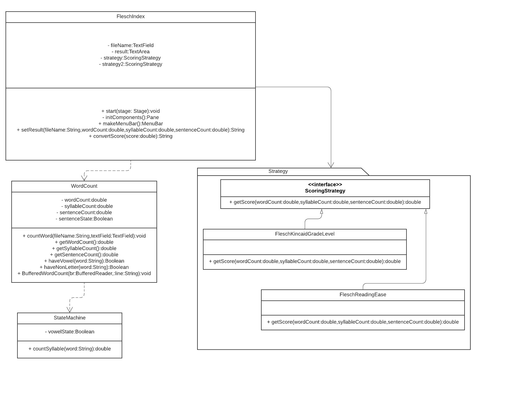

## Flesch Readability index Application

This application can compute the score of a text file from your local disk or URL.\
The score is based on how difficult it is to read a file.\
After the score is computed, the app will tell you a target audience for that file.\
This app is good for writer or book company because they can use the application to check whether their work\
is too hard to read for their target audience.

## Feature
1. Help menu: In the help menu, you can find 
  1.1 Help - Browse:  This menu will tell the user about browse button.
  1.2 Help - Convert: This menu will tell the user about convert button.
  1.3 Help - Clear:   This menu will tell the user about clear button.
  1.4 Exit: 	     This menu will exit the program.
2. Browse button:  You can use this button to browse a file on your local disk instead of typing the name of the file.
3. Convert button: By clicking on this button, The score will be compute and the result will be show.
4. Clear button:   This button will clear the file name and the result.

## How to run the jar file
1. Download FleschIndex.jar.
2. Download vmargs.txt and put it in the same directory as FleschIndex.jar.
3. Open command prompt and go into your directory that contain FleschIndex.jar and vmargs.txt.
4. type java @vmargs.txt -jar FleschIndex.jar.

## UML class diagram
